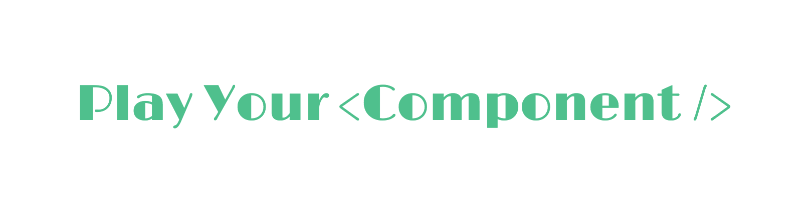

A minimalistic framework for demonstrating your Vue components, inspired by [react-storybook](https://github.com/kadirahq/react-storybook).

<details><summary>Table of Contents</summary>

<!-- toc -->

- [Getting started](#getting-started)
  * [The easy way](#the-easy-way)
  * [The hard way](#the-hard-way)
    + [App interface](#app-interface)
    + [Preview](#preview)
- [Component Shorthand](#component-shorthand)
- [Additional Component Properties](#additional-component-properties)
  * [example](#example)
  * [readme](#readme)
- [Showcase](#showcase)
- [API](#api)
  * [play.useComponents(components)](#playusecomponentscomponents)
    + [components](#components)
  * [play.describe(name, [callback])](#playdescribename-callback)
    + [name](#name)
    + [callback](#callback)
      - [add(scenario, component)](#addscenario-component)
        * [scenario](#scenario)
        * [component](#component)
  * [play.start([selector])](#playstartselector)
    + [selector](#selector)
  * [action](#action)
    + [action.log(data)](#actionlogdata)
    + [action.clear()](#actionclear)
- [Development](#development)
- [License](#license)

<!-- tocstop -->

</details>

## Getting started

### The easy way

```bash
# use npm or yarn
npm install -g vue-play-cli
cd my-vue-project
# run this to configure your project
vue-play
# to start developing `play app`
npm run play
# to build the `play app`
npm run play:build
```

### The hard way

There're two pages in your play app, one is the app interface which has a sidebar and it can toggle examples of your components, the other page is for rendering the examples, this page will be loaded as iframe in app interface.

And they both load component examples that you write in the `playspot`, let's say `./play/index.js`:

```js
import play from 'vue-play'
import MyButton from './MyButton.vue'

play('MyButton', module)
  .add('with text', h => h(MyButton, ['text']))
```

#### App interface

```js
// ./play/app.js
import app from 'vue-play/dist/app'
import 'vue-play/dist/app.css'
// loads the examples at ./play/index.js
import examples from './'

// tell app what examples you have
app(examples)
```

#### Preview

```js
// ./play/preview.js
import preview from 'vue-play/dist/preview'
// loads the examples at ./play/index.js
import examples from './'

// actually render the examples in preview page
preview(examples)
```

Add `app interface` and `preview` to your webpack entry:

```js
module.exports = {
  // ...
  entry: {
    app: './play/app.js',
    preview: './play/preview.js'
  },
  // don't forget to generate html output for both of them
  plugins: [
    HtmlWebpackPlugin({
      filename: 'index.html',
      chunks: ['app']
    }),
    HtmlWebpackPlugin({
      filename: 'preview.html',
      chunks: ['preview']
    })
  ]
}
```

That's it, you're all set!

## Component Shorthand

If you only need `template` or `render` property for your component, you can use `component shorthand`, which means you can directly set the value of scenario to a template string or render function:

```js
play.describe('Button', module)
  .add('template shorthand', '<my-button>text</my-button>')
  .add('render function shorthand', h => h(MyButton, ['text']))
  .add('full component', {
    data() {},
    methods: {},
    render(h) {}
    // ...
  })
```

## Additional Component Properties

The component for each scenario is a typical Vue component, but it can also accept some additional properties for documenting its usage, eg:

```js
play.describe('Button', module)
  add('with text', {
    // a valid vue component
    ...component,
    // additional
    example,
    // ...
  })
```

### example

Type: `string`

The example code of your component.

### readme

Type: `HTML string`

Optionally display a readme tab to show detailed usage.

## Showcase

Feel free to add your projects here:

- [button example](http://vue-play-button.surge.sh/#/) - [source](https://github.com/vue-play/vue-play/tree/master/play)
- [vue-slim-modal](https://egoistian.com/vue-slim-modal/#/) - [source](https://github.com/egoist/vue-slim-modal/tree/master/playspot)

## API

### play.useComponents(components)

#### components

Type: `object`<br>
Required: `true`

Just like the way you register local components in Vue.

```js
play.useComponents({
  'my-component-name': MyComponent
})
```

### play.describe(name, [callback])

#### name

Type: `string`<br>
Required: `true`

The name of the playspot, eg: `MyButton`.

#### callback

Type: `function`<br>
Param: `add`

If no callback function, `play.describe` will return the `add` function.

##### add(scenario, component)

The param `add` lets you add scenario to the playspot, one at a time.

###### scenario

Type: `string`<br>
Required: `true`

The scenario name, eg: `with text`

###### component

Type: `VueComponent`<br>
Required: `true`

Example component to render in this senario.

### play.start([selector])

#### selector

Type: `string`<br>
Default: `#app`

Where to mount the app.

### action

#### action.log(data)

Log data in `play app`'s console

#### action.clear()

Clear logs in current scenario.

## Development

```bash
# run example play script
npm run play

# build vue-play
# you don't need this when developing
npm run build
```

## License

[MIT](https://egoist.mit-license.org) &copy; [EGOIST](https://github.com/egoist)
