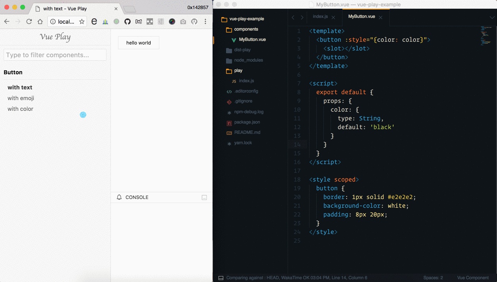

# vue-play

[](https://npmjs.com/package/vue-play) [](https://npmjs.com/package/vue-play) [](https://circleci.com/gh/vue-play/vue-play) [](https://gitter.im/vue-play/vue-play)

A minimalistic framework for demonstrating your Vue components, inspired by [react-storybook](https://github.com/kadirahq/react-storybook).



## Table of Contents

<!-- toc -->

- [Getting Started](#getting-started)
    + [App interface](#app-interface)
    + [Preview](#preview)
- [Writing Scenarios](#writing-scenarios)
  * [Keeping Scenarios](#keeping-scenarios)
  * [Writing Scenarios](#writing-scenarios-1)
  * [Loading Scenarios Dynamically](#loading-scenarios-dynamically)
  * [Register Components](#register-components)
  * [Use Component as `play()` argument](#use-component-as-play-argument)
  * [Using with Vuex](#using-with-vuex)
- [Component Shorthand](#component-shorthand)
- [Additional Component Properties](#additional-component-properties)
  * [example](#example)
  * [readme](#readme)
- [Component Injection](#component-injection)
  * [this.$log(data)](#thislogdata)
- [Showcase](#showcase)
- [Development](#development)
- [License](#license)

<!-- tocstop -->

## Getting Started

Install it:

```bash
cd my-project
npm install --save-dev vue-play vue-play-cli
# vue-play-cli gives you the `vue-play` command
# vue-play is the UI utils.
```

Add npm scripts:

```json
{
  "scripts": {
    "play": "vue-play start",
    "play:build": "vue-play build"
  }
}
```

Write `play entry` to load your examples:

```js
// ./play/index.js
import { play } from 'vue-play'
import MyButton from './components/MyButton.vue'

play('Button')
  .add('with text', h => h(MyButton, 'hello'))
  .add('with emoji', h => h(MyButton, '💫'))
```

Then just run `npm run play` and go to `http://localhost:5000`

For more usages on vue-play-cli, please head to [vue-play/vue-play-cli](https://github.com/vue-play/vue-play-cli).

<details><summary>The hard way</summary>

There're two pages in your play app, one is the app interface which has a sidebar and it can toggle scenarios of your components, the other page is for rendering the examples, this page will be loaded as iframe in app interface.

And only the latter needs to load scenarios that you write in the `play entry`, let's say `./play/index.js`:

```js
import { play } from 'vue-play'
import MyButton from './MyButton.vue'

play('MyButton')
  .add('with text', h => h(MyButton, ['text']))
```

#### App interface

```js
// ./play/app.js
import app from 'vue-play/app'

// bootstrap app
app()
```

#### Preview

```js
// ./play/preview.js
import './' // which is ./play/index.js
import preview from 'vue-play/preview'

// actually render the scenarios in preview page
// when the preview page is ready
// it will tell the app interface what scenarios we have
preview()
```

Add `app interface` and `preview` to your webpack entry:

```js
module.exports = {
  // ...
  entry: {
    app: './play/app.js',
    preview: './play/preview.js'
  },
  // don't forget to generate html output for both of them
  plugins: [
    new HtmlWebpackPlugin({
      filename: 'index.html',
      chunks: ['app']
    }),
    new HtmlWebpackPlugin({
      filename: 'preview.html',
      chunks: ['preview']
    })
  ]
}
```

That's it, you're all set!
</details>

## Writing Scenarios

`scenario`, a.k.a. story in react-storybook, it's usually an example for demostrating your real component.

### Keeping Scenarios

You can keep scenarios anywhere you want, for example you can keep them all at `./play/index.js`, you can also use separate files for them, or even name them `*.play.js` in your component directory and load them dynamically.

### Writing Scenarios

```js
import { play } from 'vue-play'
import MyButton from '../src/components/MyButton.vue'

// Use `play` to describe component title
// use .add to add scenario for that component
play('MyButton')
  .add('with text', h => h(MyButton, ['hello world']))
  .add('with emoji', h => h(MyButton, ['😃🍻']))
```

### Loading Scenarios Dynamically

We can use Webpack's [require.context](https://webpack.github.io/docs/context.html#require-context) to load modules dynamically.

```js
const load = requireContext => requireContext.keys().map(requireContext)

// load files which end with `.play.js` in `../src/components` folder
load(require.context('../src/components', true, /.play.js$/))
```

### Register Components

If you are using render function you won't need to register components, you only need this when you are using the template property, and it's same way as you do in other Vue app:

```js
// ./play/index.js
import Vue from 'vue'
import MyButton from './MyButton.vue'

// register globally
Vue.component('my-button', MyButton)

play('MyButton')
  .add('with text', {
    template: '<my-button>text</my-button>'
  })
```

You can also [register components locally](https://vuejs.org/v2/guide/components.html#Local-Registration).

### Use Component as `play()` argument

```js
import MyButton from './MyButton.vue'

// assuming MyButton.name is 'my-button'
play(MyButton)
  // MyButton will be automatially registered in scenarios
  // so you don't have to register it again
  .add('with text', '<my-button></my-button>')

// then the app sidebar will look like:
// - my-button
//    - with text
```

To customize the `displayName` in sidebar and the `componentName` which is used to register itself in scenarios, you can simply set them in your component:

```vue
<!-- ./MyButton.vue -->
<script>
  export default {
    name: 'my-other-button',
    displayName: 'Show off my cute button'
  }
</script>
```

Or use methods:

```js
play(MyButton)
  .name('my-other-button')
  .displayName('Show off my cute button')
  .add('with text', '<my-other-button>text</my-other-button>')
```

### Using with [Vuex](https://github.com/vuejs/vuex)

If your component is using [Vuex](https://github.com/vuejs/vuex) data store, you can pass store as an argument for a full component, just like you would in a normal Vue instance.

First, load Vuex in your `./play/index.js` file:

```js
import Vue from 'vue'
import Vuex from 'vuex'

Vue.use(Vuex)
```

And then pass a Vuex Store instance like so:

```js
import Vuex from 'vuex'

play('Monster', module)
  .add('mutating tentacle monster', {
    store: new Vuex.store({
      state: {
        type: 'TENTACLE_MONSTER',
        tentacles: 12
      },
      getters: {
        attack: state => tentacles * TENTACLE_DAMAGE
      },
      mutations: {
        mutateTentacle(state, mutagenStrength) {
          state.tentacles = state.tentacles * mutagenStrength
        }
      }, 
      actions: {
        mutateTentacle({ commit }, data) {
          asyncServerOperation(data, (err, mutagenStrength) => {
            commit('mutateTentacle', mutagenStrength)
          })
        }
      }
    }),
    render(h) {}
    // ...
  })
```

You can use multiple Vuex Store instances. State always resets to the initial value when you switch between scenarios.

## Component Shorthand

If you only need `template` or `render` property for your component, you can use `component shorthand`, which means you can directly set the value of scenario to a template string or render function:

```js
import Example from './Example.vue'
play('Button')
  .add('template shorthand', '<my-button>text</my-button>')
  .add('render function shorthand', h => h(MyButton, ['text']))
  .add('full component', {
    data() {},
    methods: {},
    render(h) {}
    // ...
  }).
  .add('single file', Example)
```

**note:** If you are using `template` shorthand or `template` property in component options, you should use [Vue standalone build](https://vuejs.org/guide/installation.html#Standalone-vs-Runtime-only-Build) as well. For `vue-play-cli`, it's as simple as using `--standalone` option.

## Additional Component Properties

The component for each scenario is a typical Vue component, but it can also accept some additional properties for documenting its usage, eg:

```js
play('Button')
  .add('with text', {
    // a valid vue component
    ...component,
    // additional
    example,
    // ...
  })
```

### example

Type: `string`

The example code of your component.

### readme

Type: `HTML string`

Optionally display a readme tab to show detailed usage.

## Component Injection

### this.$log(data)

Log data to app console.

## Showcase

Feel free to add your projects here:

- [button example](http://vue-play-button.surge.sh/#/) - [source](https://github.com/vue-play/vue-play/tree/master/play)
- [vue-slim-modal](https://egoistian.com/vue-slim-modal/#/) - [source](https://github.com/egoist/vue-slim-modal/tree/master/play)

## Development

```bash
# run example play script
npm run play

# build vue-play
# you don't need this when developing
npm run build
```

## License

[MIT](https://egoist.mit-license.org) &copy; [EGOIST](https://github.com/egoist)
